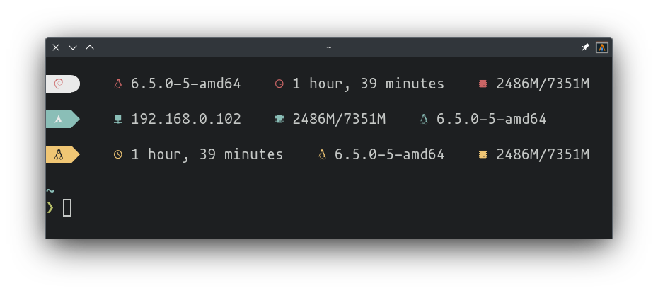

<p align="center"> 
    

    <h1>Linefetch</h1>

    <p>A simple customizable one liner fetch tool</p>
</p>

# Installation

Currently we do not provide any prebuilt binaries nor we have official packages in any linux distro repositories. You have to compile the code yourself to get an executable.

## Prerequisites

You'll need a few packages to be able to build the code:

- git
- rust/cargo

## Building the code

First you'll need to clone the repo:

```bash
git clone https://github.com/norbert204/linefetch.git &&
cd linefetch
```

Next you'll need to run the following to build the code:

```bash
cargo build
```

Now you will find the executable under the `target/debug` subfolder:

```bash
cd target/debug &&
./linefetch
```
