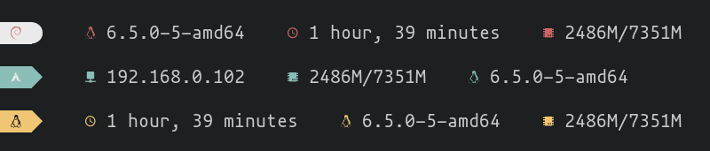

<h1 align="center">Linefetch</h1>
<p align="center">A simple customizable one liner fetch tool for GNU/Linux systems written in Rust</p>



# Installation

Currently we do not provide any prebuilt binaries nor we have official packages in any linux distro repositories. You have to compile the code yourself to get an executable.

## Prerequisites

You'll need a few packages to be able to build the code:

- git
- rust/cargo

## Building the code

First you'll need to clone the repo:

```bash
git clone https://github.com/norbert204/linefetch.git &&
cd linefetch
```

Next you'll need to run the following to build the code:

```bash
cargo build
```

Now you will find the executable under the `target/debug` subfolder:

```bash
cd target/debug &&
./linefetch
```

# Configuration

Configuration can be done via the `config.json` file under `$XDG_CONFIG_HOME/linefetch`. This file gets automatically generated after first run.

## Supported config values

| Name | Type | Description |
| -- | -- | -- |
| `modules` | string list | Which modules to show in the fetch. Supported modules can be found below. The list should must `3` modules! | 

## Supported modules

| Name | Description |
| -- | -- |
| `ip-address` | Shows the systems local IP address |
| `kernel` | Shows the currently loaded Linux kernel version |
| `memory` | Shows the currently used and total amount of RAM |
| `uptime` | Shows the system's current uptime |
